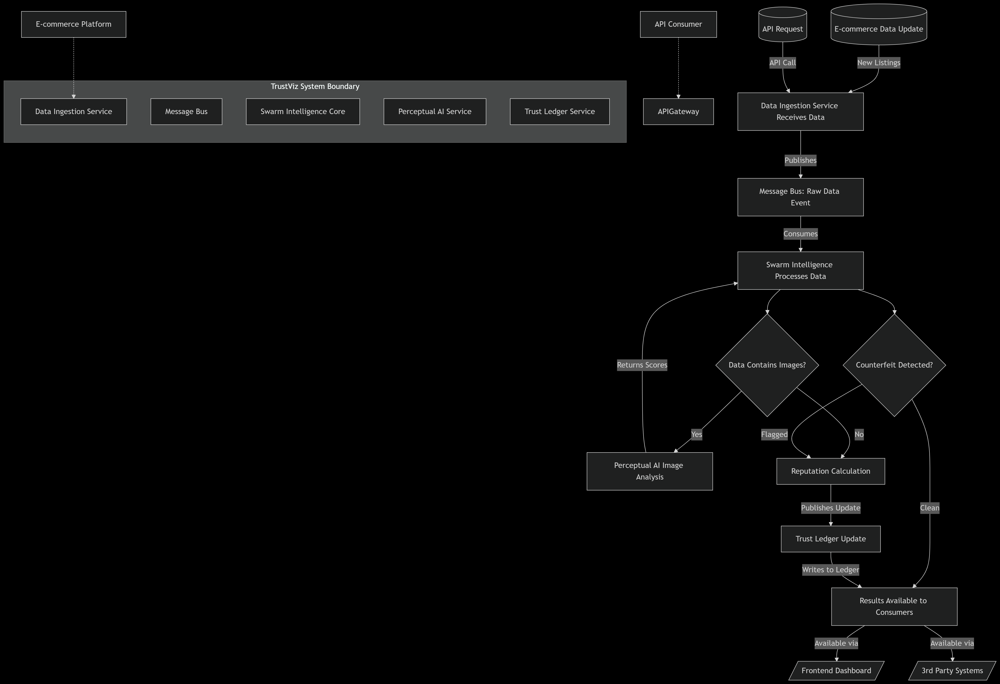

# Trust-viz: A Comprehensive Trust Scoring System

Trust-viz is an advanced system designed to enhance trust and transparency in online marketplaces by identifying and mitigating fraudulent activities. It integrates multiple analytical modules—Image Authenticity Analysis, Review Authenticity Analysis, and Seller Behavioral Profiling—to generate a comprehensive Trust Score for products and sellers.

## The Counterfeit Crisis

The global counterfeit market reached an alarming **$2.2 trillion in 2022**, significantly impacting economies and consumer trust. The surge in e-commerce has exacerbated this issue, with online counterfeits increasing by **40% during the pandemic**. Major platforms like Amazon blocked **6 billion bad listings in 2022**, highlighting the scale of the problem and the erosion of trust among online shoppers who frequently receive counterfeit products.

## Limitations of Current Solutions

Existing approaches to combating counterfeits often fall short due to several limitations:
*   **Manual Reviews**: These processes are slow, expensive, and cannot keep pace with the sheer volume of new listings.
*   **Basic Image Matching**: Simple image matching techniques are easily bypassed by sophisticated counterfeiters who use slightly altered or AI-generated images.
*   **Seller Verification**: Fraudulent sellers can often fake verification credentials, making it difficult to distinguish legitimate businesses from bad actors.

## TrustViz's Multi-Layered Defence

Trust-viz employs a robust, multi-layered defense system to combat counterfeiting effectively:
*   **Product Listing**: Initial data capture of all product information.
*   **Data Ingestion**: Comprehensive collection of product data, including images, reviews, and seller profiles.
*   **Perceptual AI**: Advanced image analysis verifies material texture, logo placement, print quality, and packaging authenticity. It also detects AI-generated images, achieving **95% accuracy** in detecting counterfeits.
*   **Swarm Intelligence**: Inspired by ant colony optimization, this module uses multiple agents to analyze price patterns, seller behavior, image authenticity, and customer feedback. This self-learning system adapts to new fraud patterns.
*   **Blockchain Record / Trust Ledger**: Secure, decentralized, and immutable record-keeping of trust scores and related verification data, ensuring transparency and integrity.

## TrustViz vs. Traditional Systems

TrustViz offers significant advantages over traditional anti-counterfeiting systems:

| Feature           | Traditional Systems     | TrustViz                  |
| :---------------- | :---------------------- | :------------------------ |
| Image Analysis    | Single algorithm        | Multi-algorithm DinoHash  |
| Trust Storage     | Centralized database    | Blockchain ledger         |
| Decision Making   | Rule-based              | Swarm intelligence        |
| Processing Time   | Batch processing        | Real-time                 |
| Cross-platform    | No                      | Yes                       |
| Trust History     | Mutable                 | Immutable                 |

## Why Blockchain Matters

The integration of blockchain technology in TrustViz provides critical benefits:
*   **Immutable Reputation**: Seller history and performance are permanently recorded and follow them across platforms, preventing fraudulent sellers from simply creating new accounts.
*   **Fraud Reduction**: Contributes to a **92% reduction** in counterfeit incidents.
*   **Faster Detection**: Enables **70% faster** fraud detection, allowing for quicker intervention and mitigation.

## Features

### 1. Image Authenticity Analysis (Perceptual AI)
**Goal**: To detect stolen, tampered, or fake product images.
**Logic**:
*   **Image Hashing (phash/dhash)**: Checks for exact or near-exact duplicates of known brand images.
*   **CLIP / Image Embedding Similarity**: Assesses semantic similarity between product images and verified brand images.
*   **Quality Check (Blur/Watermark Detection)**: Identifies low-quality, blurred, or watermarked images indicative of tampering or unprofessional listings.
**Output**: A weighted `image_score` (0.5 * hash_match + 0.3 * clip_similarity + 0.2 * quality_check).

### 2. Review Authenticity Analysis (Review Analyzer)
**Goal**: To identify fake or bot-generated reviews.
**Logic**:
*   **Uniqueness Check (TF-IDF + Cosine Similarity)**: Measures similarity among reviews to detect repeated or templated text.
*   **Time Burst Check**: Identifies suspicious patterns of reviews posted too quickly.
*   **Sentiment Analysis (BERT model)**: Detects overly positive or exaggerated sentiment.
*   **Verified vs. Unverified Purchase**: Applies weight based on purchase verification status.
**Output**: A `review_score` (0.4 * uniqueness + 0.3 * timestamp_check + 0.2 * verified_ratio + 0.1 * sentiment_score).

### 3. Seller Behavioral Profile (Seller Behavior Analyzer)
**Goal**: To analyze a seller's general behavior and activity for suspicious patterns.
**Logic**:
*   **Account Age**: Flags very new accounts with high product listings.
*   **Listing Growth Rate**: Detects rapid, unnatural increases in product uploads.
*   **Description/Image Reuse**: Identifies duplicate content across multiple listings or sellers.
*   **Refund/Return Rate**: Flags unusually high return rates.
*   **User Complaints**: Aggregates and assesses the severity of user reports.
*   **Product Overlap**: Identifies sellers sharing identical products/images, potentially indicating fraud networks.
**Output**: A `behavior_score` (0.2 * account_age_score + 0.3 * growth_rate_score + 0.2 * description_reuse_score + 0.3 * complaint_score).

### Trust Score Engine (Swarm Intelligence & Trust Ledger)
The outputs from the Image, Review, and Seller analysis modules feed into a central Trust Score Engine. This engine, likely leveraging "Swarm Intelligence" for aggregation and "Trust Ledger" for immutable record-keeping (blockchain), combines these individual scores into a holistic Trust Score for products and sellers.

## Architecture Overview

Here's a high-level overview of the Trust-viz system architecture:



The system is composed of several microservices, each responsible for a specific analytical task:
*   **Data Ingestion**: Responsible for collecting raw data (images, reviews, seller profiles).
*   **Perceptual AI**: Handles image authenticity analysis.
*   **Review Analyzer**: Processes and authenticates product reviews.
*   **Seller Behavior Analyzer**: Profiles seller activities.
*   **Swarm Intelligence**: Likely aggregates and processes data from various modules to derive insights.
*   **Trust Ledger**: A blockchain-based component for maintaining an immutable record of trust scores and related data.

These services communicate to provide a comprehensive trust assessment.

## Technologies Used

*   **Python**: Primary programming language for all services.
*   **Docker / Docker Compose**: For containerization and orchestration of microservices.
*   **Image Processing**: `imagehash`, `OpenCV` for image analysis.
*   **Natural Language Processing**: `CLIP` (for image-text similarity), `BERT` (HuggingFace) for sentiment analysis, `TF-IDF`, `Cosine Similarity` for text uniqueness.
*   **Data Analysis**: Time-series anomaly detection, graph-based linkage.
*   **Blockchain**: For the Trust Ledger component.

## Setup and Installation

To set up and run the Trust-viz system locally, follow these steps:

1.  **Prerequisites**:
    *   [Docker](https://www.docker.com/get-started) installed on your system.
    *   [Docker Compose](https://docs.docker.com/compose/install/) installed.

2.  **Clone the repository**:
    ```bash
    git clone https://github.com/your-repo/Trust-viz.git
    cd Trust-viz
    ```

3.  **Build and run the services**:
    The `docker-compose.yml` file orchestrates all the microservices.
    ```bash
    docker-compose up --build
    ```
    This command will build the Docker images for each service and start them.

4.  **Accessing Services**:
    Once the services are running, you can interact with them via their exposed ports (if any) or through internal Docker network communication. Refer to individual service documentation (e.g., `services/perceptual-ai/README.md`) for specific API endpoints or usage instructions.

## Usage

(Further details on how to use the system, e.g., API endpoints, input formats, and expected outputs, would be provided here. This section can be expanded as the project develops.)

## Contributing

(Information on how to contribute to the project, including guidelines for code style, pull requests, and issue reporting, would go here.)

## License

(Information about the project's license would go here.)