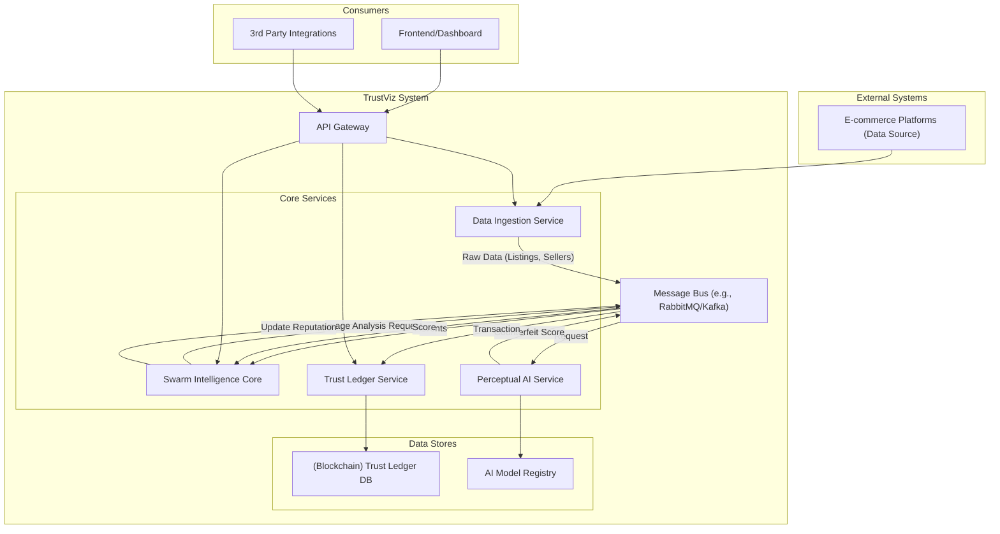

# TrustViz System Architecture

This document outlines the high-level, service-oriented architecture for the TrustViz platform.

## Architecture Diagramj

## Component Descriptions

*   **Data Ingestion Service:** Responsible for collecting data from e-commerce platforms via APIs or other means. It publishes raw data to the Message Bus.
*   **Swarm Intelligence Core:** A network of decentralized agents that subscribe to data events from the Message Bus. These agents perform initial analysis, coordinate tasks, and decide when to invoke the Perceptual AI or update the Trust Ledger.
*   **Perceptual AI Service:** A specialized service that exposes an API for visual counterfeit detection. It will receive image data, process it using Vision Transformers and other models, and return a confidence score.
*   **Trust Ledger Service:** Manages the immutable reputation ledger. It provides an API to record reputation events (transactions) and query seller trust scores.
*   **API Gateway:** A single entry point for all external-facing communication, routing requests to the appropriate internal services.
*   **Message Bus:** The central nervous system for asynchronous communication between services, ensuring loose coupling and resilience.